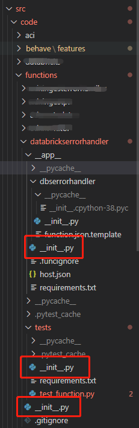
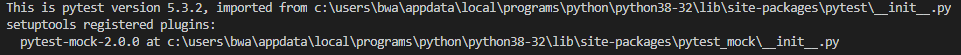
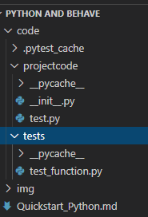
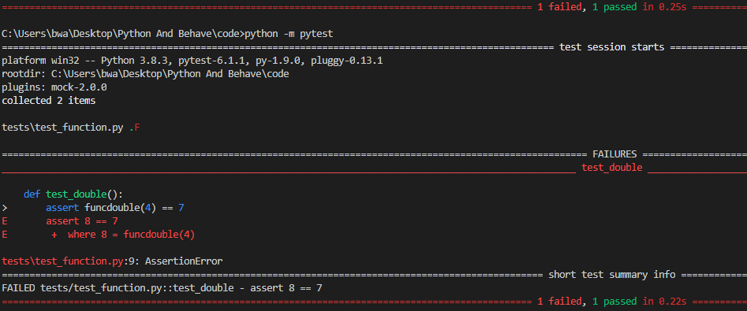
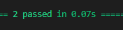
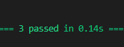
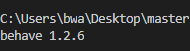

# Python Quick Start
1. The purpose of this document is for developers without Python experience to quickly learn and use in the project, accelerate the construction of the fast development environment and promote team cooperation. So this document does not cover Python programming language learning itself so assume you have basic programming background. 

2. this document cover setup Python development environment and how to use pytest do unit test then how to use behave test
   1. If you have a Python development environment that you can use directly, I'm using VS code [here](https://code.visualstudio.com/)
   2. please flow this [tutorial](https://code.visualstudio.com/docs/python/python-tutorial) to setup your python dev environment
      1. [Python extension for VS Code](https://marketplace.visualstudio.com/items?itemName=ms-python.python)
      2. [Python SKD](https://www.python.org/downloads/) Please note your version of Windows (Windows x86-64), automatic downloading is not recommended, because the last time I downloaded the x86 version automatically and my computer was on x64 CPU, I had a long search problem.
      3. just follow the document creat your first python app which is "hello world"

3. For beginners of Python, one problem that has wasted me a lot of time is the references to different py files, because Python doesn't have namespace like Java or C#, so to know how to references to methods or classes are very important.
   1. Here I recommend the simplest way its add the __ init __.py file with each file directory that means to create a package base on the .py file in this folder. 
   2. some referance [Modules](https://docs.python.org/3/tutorial/modules.html) and [How to create a Python Package with __ init __.py](https://timothybramlett.com/How_to_create_a_Python_Package_with___init__py.html)
   

4. ### Python unit test (pytest)
   1. Unit testing is a key part of software development, and the first time I did it in Python is with Pytest, which was very easy to use, so the next i will talk about Pytest from my experence.
   2. pytest env
      1. install pytest
         -  ```pip install -U pytest```
      2.  Verify the installation
          -  ```pytest --version```
      
      3. pytest official document
         - [Full pytest documentation](https://docs.pytest.org/en/latest/contents.html)
  
   3. In the PyTest framework, there are the following constraints
      1. All UT file names need to be in either the test_*.py or *_test.py format.
      2. In a UT file, the Test class starts with Test and cannot have an init method (note: when defining a class, you need to start with T, otherwise Pytest won't run the class)
      3. In a test class, you can include one or more functions beginning with Test_
      4. When the Pytest command is executed, test functions that match the above constraints are automatically searched from the current directory and subdirectories for execution.
   4. there is an simple code you can download it and run this pytest and the file structure seems like this：
   - 
   - The test code is very simple which two functions addition and a doubling named **test.py** 
   ```python
         def func(x):
            return x + 1

         def funcdouble(x):
            return x * 2
   ```
    - pytest file under the tests forlder named **test_function.py** there import two function from test.py file and define 2 functions est_plus() and test_double()
   ```python
         from projectcode.test import func, funcdouble

         def test_answer():
            assert func(4) == 5

         def test_double():
            assert funcdouble(4) == 7
   ```
    - run pytest command 
   
   ```
   python -m pytest
   ```
    - Because I made a mistake in writing double as results so this is going to result in one failure and one pass
 

     - if you can correct my mistake that change the double function result from 7 to 8, then run Pytest again and you will get two passes.
      - 
 
   5. Another important concept you need to know its **mock** some times When you write unit test, you don’t really care whether the API call runs or not. 
   I just want to know when I develop is that my code works as expected when API returns correct data.
   If I can provide fake data without calling the API, then I don’t have to sit there are wait for the test to complete. This is where mocks come in.
      1. [unittest.mock official document](https://docs.python.org/3/library/unittest.mock.html)

      2. there I do a mock function **funccalculate** in this function i have call the function **funcdouble** In fact, I just care about the execution of the function and don't care about the return value so I can do this way:
   
      3. **funccalculate**
      ```python
         def funccalculate(x):
            return funcdouble(x)
      ```
      4. **test_calculate**
      ```python
         def test_calculate(mocker):
            num = 5
            mock_move_blob_file = mocker.patch('projectcode.test.funcdouble')
            mock_move_blob_file.return_value = 10
            projectcode.test.funccalculate(num)
            assert mock_move_blob_file.called
      ```
      5. run pytest again you will get 3 pass
      - 

## Behavior Driven Development
Behavior-driven development (or BDD) is an agile software development technique that encourages collaboration between developers, QA and non-technical or business participants in a software project.
1. the advantage of behave
   1. In my understanding is that a way for non-technical people to easy understand and even to help develop tests by using Gherkin Language. it also makes integration testing clearer and easier to management.
   2. behave test is scenario based which means behave is not in unit tests level it could be leverage unit tests or beyond unit tests and test multiple modules in series.
   3. For me in the last project that is public cloud architecture based project so I was to use Behave test between different cloud services of the stability in several Behave scenarios
2. Installation of behave environment
   1. It is recommended that you install directly by using PIP
    ```python
      # Execute the following command to install behave with pip:
      pip install behave

      # To update an already installed behave version, use:
      pip install -U behave
      ```
   2. Check your installation just input command 'behave --version' it should be print out behave version number in my case its 1.2.6
   ```python
   behave --version
   ```
   
3. behave implementation
   1. you need create an behave *__.feature__* file and this file use to define test scenarios and you can create it and under the feature folder and you could use this feature folder save more feature file and each file for different test scenarios.
   2. Then you should create an steps folder for save script file this file name should same as feature file name but the the extension name is .py  YES its seems like __Code-behind__ model but the *.feature file is basd on Gherkin Language.
   3. For steps folder you can also put some common/utility files into it